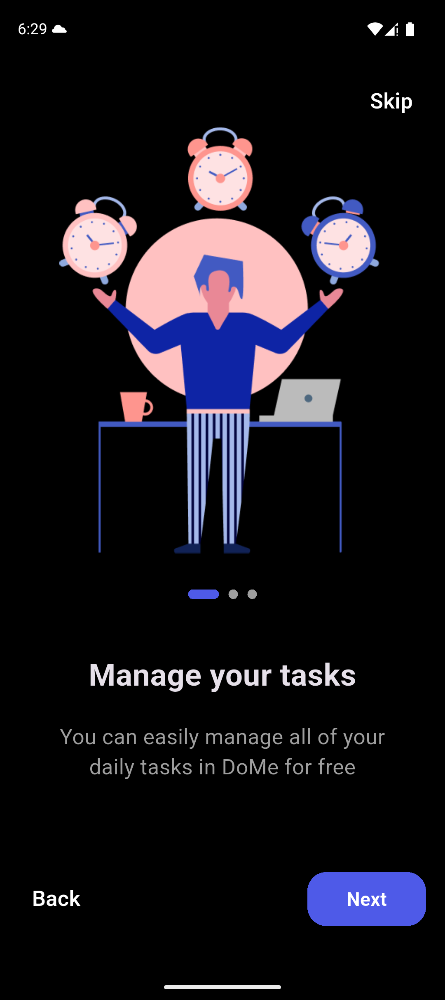
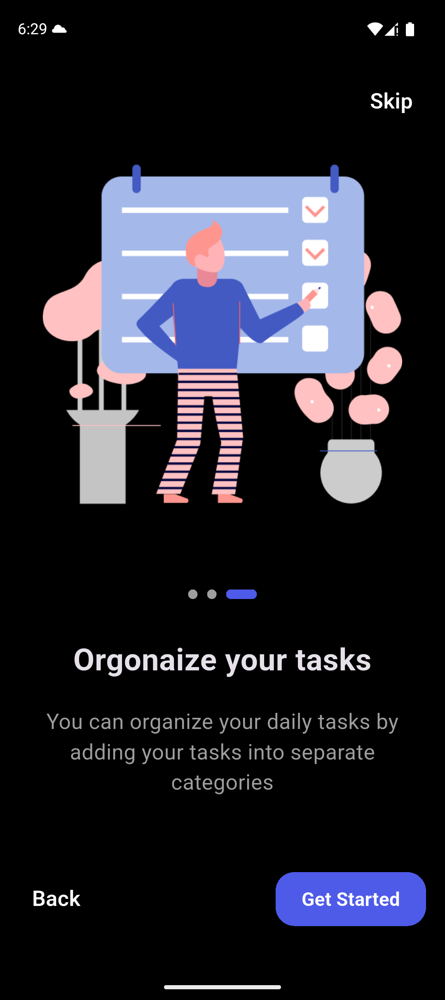

# 🚀 Taskify App

|  |  |  |

> **Taskify** is a modern and minimalistic task management app designed to help you organize your day with ease.  
> It allows you to create tasks with custom categories and colors, set reminders and repeat schedules, and stay focused with a built-in focus mode.  
> Built with a clean MVVM architecture, local database, and state management to ensure a smooth and responsive experience.

---

## ✨ Features
- Add new tasks with custom category and card color selection.
- Focus Mode to minimize distractions and boost productivity.
- Set Local Notifications with flexible reminders and repeat options.
- Full Settings screen (change account name, password, profile image, and toggle theme mode).
- Beautiful Onboarding experience for first-time users.
- Supports both Dark Mode and Light Mode.

---

## 🛠 Tech Stack
- Dart
- Flutter
- MVVM Architecture
- BLoC (State Management)
- SQFLite (Local Database)
- Shared Preferences (Local Storage)
- Local Notifications (flutter_local_notifications)
- flutter_screenutil (Responsive app design)

---

## 📥 Download

[🔗 Download APK from Google Drive](https://drive.google.com/drive/folders/12lWXLEjITDdCj1uG-GlKcPH2eQIpfRew?usp=drive_link)

---

## 🚀 Getting Started

1. Clone the repository:
   ```bash
   git clone https://github.com/KarimTamer74/taskify-app.git
