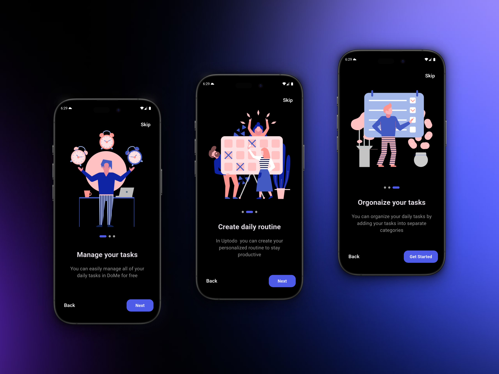
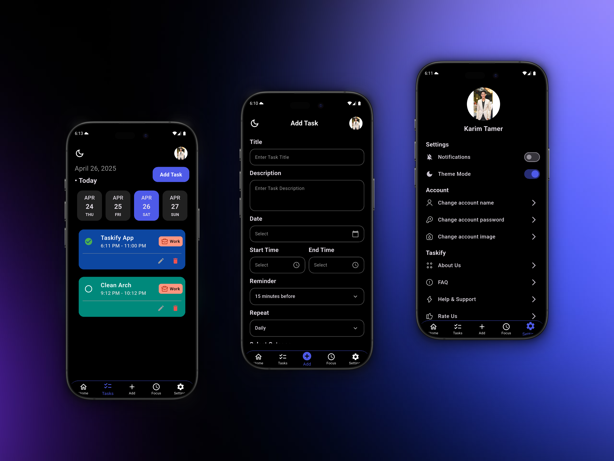

# 🚀 Taskify App





> **Taskify** is a modern and minimalistic task management app designed to help you organize your day with ease.  
> It allows you to create tasks with custom categories and colors, set reminders and repeat schedules, and stay focused with a built-in focus mode.  
> Built with a clean MVVM architecture, local database, and state management to ensure a smooth and responsive experience.

---

## ✨ Features
- Add new tasks with custom category and card color selection.
- Focus Mode to minimize distractions and boost productivity.
- Set Local Notifications with flexible reminders and repeat options.
- Full Settings screen (change account name, password, profile image, and toggle theme mode).
- Beautiful Onboarding experience for first-time users.
- Supports both Dark Mode and Light Mode.

---

## 🛠 Tech Stack
- 
- 

**Architecture**: Clean MVVM with BLoC  
**State Management**: BLoC Pattern  
**Local Database**: SQFLite & Shared Preferences 
**Notifications**: flutter_local_notifications  
**UI**: Responsive design with flutter_screenutil  

---
## 📦 Installation
### Option 1: Download APK
[](https://drive.google.com/drive/folders/12lWXLEjITDdCj1uG-GlKcPH2eQIpfRew)

### Option 2: Build from Source
1. Clone the repo:
   ```bash
   git clone https://github.com/KarimTamer74/taskify-app.git
   cd taskify-app
